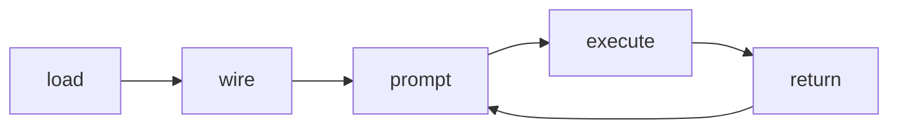
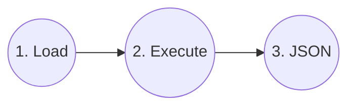

# Agent loops with Skillware

Every integration follows the same execution pattern. **Skillware** loads the bundle and adapts it to your runtime's tool format; **your host app** calls `execute()` and passes JSON back to the model. The diagram below is the loop you implement in code — for bundle contents, see the [Introduction](../introduction.md).



| Role | Steps |
| :--- | :--- |
| **Skillware** | load, wire |
| **Model** | prompt, return |
| **Host** | execute |

1. `bundle = SkillLoader.load_skill("<category>/<skill_name>")`
2. `skill = bundle["class"]()` — or `SkillLoader.get_skill_class(bundle)()`; `bundle["module"]` remains available for backward compatibility.
3. Adapt `bundle` for the model (`to_gemini_tool`, `to_claude_tool`, etc.).
4. Pass `bundle["instructions"]` as system context.
5. On tool call, **optionally** validate arguments with `skill.validate_params(arguments)` against manifest `parameters` JSON Schema (recommended before `execute()` in production agent loops), then `result = skill.execute(arguments)` and return JSON to the model.

| Step | Call |
| :--- | :--- |
| **load** | `SkillLoader.load_skill(id)` |
| **wire** | `to_*_tool(bundle)` + `bundle["instructions"]` &rarr; model |
| **prompt** | User query &rarr; model |
| **execute** | Optional: `skill.validate_params(args)`; then `bundle["class"]().execute(args)` |
| **return** | Tool result &rarr; model |

### Direct path (no model)

You can also run skills directly without an LLM or agent loop (e.g., `examples/token_limiter_loop.py`): load the skill, call `execute(args)` directly, and process the returned JSON. **`validate_params()` is optional** — direct scripts and many examples skip it; skills may still validate or error inside `execute()`.



Provider guides contain full API details. Skill pages contain copy-paste examples with skill-specific paths and sample user messages.

OpenAI-compatible hosts reuse `to_openai_tool()`; see the [host guide](openai_compatible.md) and runnable [Groq example](../../examples/openai_compatible_host.py).

**Optional param validation:** Some agent-loop examples (e.g. `claude_wallet_check.py`, `gemini_tos_evaluator.py`) call `skill.validate_params(...)` before `execute()`; others call `execute()` directly.

---

## Tool name matching

| Adapter | Match tool calls using |
| :--- | :--- |
| Gemini | `SkillLoader._sanitize_gemini_tool_name(bundle["manifest"]["name"])` (e.g. `compliance_tos_evaluator`) |
| Claude | `manifest["name"]` (may include slashes, e.g. `compliance/tos_evaluator`) |
| OpenAI | `to_openai_tool(bundle)["function"]["name"]` (sanitized, e.g. `compliance_tos_evaluator`) |
| DeepSeek | `to_deepseek_tool(bundle)["function"]["name"]` (same sanitization rules) |
| Ollama (prompt) | `"tool"` field in the JSON block the model emits (same as `manifest["name"]` when the manifest uses the full registry ID) |

**Registry manifest names:** Every bundled skill uses `manifest["name"]` = `category/skill_name` (for example `office/pdf_form_filler`, `defi/evm_tx_handler`). Match tool calls with `bundle["manifest"]["name"]` on Claude, or derive sanitized names from the adapter on Gemini, OpenAI, and DeepSeek (`office_pdf_form_filler`, `defi_evm_tx_handler`). Do not hardcode legacy short names in examples. `SkillLoader.load_skill()` warns when `name` diverges from the folder path for registry-layout skills; use `bundle.get("registry_id")` for the path-derived ID when present.

## Minimal execute (no LLM)

```python
from skillware.core.loader import SkillLoader

bundle = SkillLoader.load_skill("compliance/tos_evaluator")
result = bundle["class"]().execute(
    {
        "target_url": "https://example.com",
        "intended_action": "crawl documentation for research",
    }
)
print(result)
```

---

## Reference scripts

Full runnable loops live under `examples/` where listed. See the
[examples index](../../examples/README.md) for script filenames, skill IDs,
per-skill pip extras, SDK extras, and required environment variables. Install
each skill with `pip install "skillware[<category>_<skill>]"` (see
[Install extras](install_extras.md)). Gemini reference scripts use the
`google-genai` SDK (`import google.genai`). All [skill catalog pages](../skills/README.md)
include compact **Usage Examples** per provider.

`Local execute / mixed` means the checked-in script is not a single-provider
agent loop. It either calls `skill.execute(...)` directly or loads multiple
skills in one harness.

| Skill | Local execute / mixed | Gemini | Claude | OpenAI | DeepSeek | Ollama |
| :--- | :--- | :--- | :--- | :--- | :--- | :--- |
| `compliance/tos_evaluator` | - | `gemini_tos_evaluator.py` | `claude_tos_evaluator.py` | `openai_tos_evaluator.py` | `deepseek_tos_evaluator.py` | `ollama_tos_evaluator.py` |
| `finance/wallet_screening` | - | `gemini_wallet_check.py` | `claude_wallet_check.py` | (catalog page) | (catalog page) | `ollama_skills_test.py` (multi-skill) |
| `office/pdf_form_filler` | - | `gemini_pdf_form_filler.py` | `claude_pdf_form_filler.py` | (catalog page) | (catalog page) | `ollama_skills_test.py` (multi-skill) |
| `compliance/mica_module` | - | `mica_rag_flow.py` | `mica_claude_flow.py` | (catalog page) | (catalog page) | `mica_ollama_flow.py` |
| `compliance/pii_masker` | `pii_guardrail_flow.py` (local execute) | (catalog page) | (catalog page) | (catalog page) | (catalog page) | (catalog page) |
| `creative/bg_remover` | (catalog page) | (catalog page) | (catalog page) | (catalog page) | (catalog page) | (catalog page) |
| `optimization/prompt_rewriter` | `prompt_compression_demo.py` (local execute) | (catalog page) | (catalog page) | (catalog page) | (catalog page) | `ollama_skills_test.py` (multi-skill) |
| `data_engineering/synthetic_generator` | `build_dataset_demo.py` (local execute, Gemini backend) | (catalog page) | (catalog page) | (catalog page) | (catalog page) | (catalog page) |
| `data_engineering/novelty_extractor` | `novelty_extractor_demo.py` (local execute) | `gemini_novelty_extractor.py` | (catalog page) | (catalog page) | (catalog page) | `ollama_novelty_extractor.py` |
| `dev_tools/issue_resolver` | - | `gemini_issue_resolver.py` | `claude_issue_resolver.py` | (catalog page) | (catalog page) | `ollama_issue_resolver.py` |
| `wellness/mental_coach` | `mental_coach_demo.py` (local execute) | (catalog page) | (catalog page) | (catalog page) | (catalog page) | (catalog page) |
| `defi/evm_tx_handler` | - | `gemini_evm_tx_handler.py` | `claude_evm_tx_handler.py` | - | - | - |
| `monitoring/token_limiter` | `token_limiter_loop.py` (local execute) | `gemini_token_limiter.py` | `claude_token_limiter.py` | (catalog page) | (catalog page) | (catalog page) |
| `finance/uk_companies_house_handler` | `uk_companies_house_handler_demo.py` | `gemini_uk_companies_house_handler.py` | (catalog page) | (catalog page) | (catalog page) | (catalog page) |
