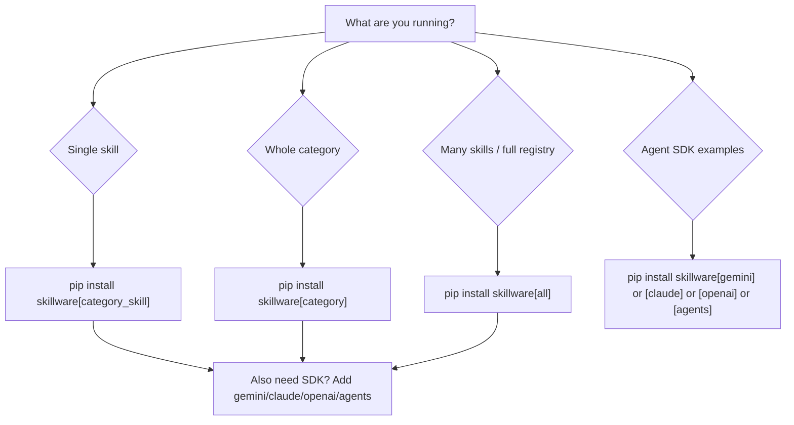

# Install extras

Skillware ships as **one PyPI wheel**. Every bundled registry skill is included on disk after `pip install skillware`. Optional **extras** add Python packages only — they do not download or hide skill bundles.

Use this guide to choose the smallest install that matches what you run. For loading skills after install, see [Finding skills on disk](README.md#finding-skills-on-disk).

## Quick reference

| Goal | Install command |
| :--- | :--- |
| Framework + all skills on disk (no optional runtime packages) | `pip install skillware` |
| **Recommended:** one bundled skill (always use this in docs) | `pip install "skillware[<category>_<skill>]"` |
| All skills in a category | `pip install "skillware[<category>]"` |
| Every bundled skill's runtime deps | `pip install "skillware[all]"` |
| Agent SDK adapters (Gemini, Claude, OpenAI) | `pip install "skillware[gemini]"` (or `[claude]`, `[openai]`, `[agents]`) |
| Clone-repo development + tests | `pip install -e ".[dev,all]"` |
| Development + agent SDK examples | `pip install -e ".[dev,all,agents]"` |

> **Pip rule:** `pip install "skillware[extra]"` always installs **core + extra** dependencies. There is no extra-only install without the `skillware` package.

> **Shell quoting:** Use quotes on zsh and fish — e.g. `pip install "skillware[finance_wallet_screening]"`.

> **Docs convention:** Catalog pages, examples, and skill guides always recommend the **per-skill extra** (`category_skill`), even when it is empty today. When a skill gains new manifest `requirements`, run `python scripts/sync_extras.py` — docs stay unchanged.

## Base install

```bash
pip install skillware
```

Includes:

- Core framework (`SkillLoader`, CLI, discovery)
- All bundled registry skills under `site-packages/skills/`
- Core runtime dependencies: `requests`, `pyyaml`, `python-dotenv`, `beautifulsoup4`, `packaging`, `jsonschema`, `rich`

Does **not** include optional skill runtime packages (for example `web3`, `fastembed`, `pymupdf`, `google-genai`) or agent SDK packages (`anthropic`, `openai`). If you load a skill that needs them, `SkillLoader` raises an `ImportError` with suggested extras (see [Loader behavior](#loader-behavior)).

## Which extra should I use?



- **Single skill in production or documentation** — always use the per-skill extra (`pip install "skillware[category_skill]"`), even when it adds no packages yet.
- **Exploring a domain** — use the category extra.
- **CI, contributors, or multi-skill apps** — use `[all]`.
- **Runnable examples under `examples/`** — list each skill's extra plus an SDK extra (`[gemini]`, `[claude]`, …) when the provider is not local execute.

Skill extras are **orthogonal** to SDK extras. Example: `office/pdf_form_filler` needs `[office_pdf_form_filler]` for `pymupdf` and `anthropic`; a Gemini agent loop around it also needs `[gemini]`.

## Category extras

Union of non-core `requirements` from every skill in the category.

| Extra | Skills | Packages installed |
| :--- | :--- | :--- |
| `compliance` | `compliance/mica_module`, `compliance/pii_masker`, `compliance/tos_evaluator` | `google-genai` |
| `data_engineering` | `data_engineering/novelty_extractor`, `data_engineering/synthetic_generator` | `fastembed`, `numpy` |
| `defi` | `defi/evm_tx_handler` | `web3>=6.0.0` |
| `dev_tools` | `dev_tools/issue_resolver` | *(none today)* |
| `finance` | `finance/uk_companies_house_handler`, `finance/wallet_screening` | *(none today)* |
| `monitoring` | `monitoring/token_limiter` | *(none today)* |
| `office` | `office/pdf_form_filler` | `anthropic`, `pymupdf` |
| `optimization` | `optimization/prompt_rewriter` | *(none today)* |
| `wellness` | `wellness/mental_coach` | `google-genai` |

```bash
pip install "skillware[defi]"
```

When a new category or skill lands (for example a future `creative` category), run `python scripts/sync_extras.py` after merging the skill manifest — category and skill rows appear in `pyproject.toml` automatically.

## Skill extras

One extra per bundled registry skill. Naming: `{category}_{skill_name}` (registry `/` becomes `_`).

| Extra | Registry ID | Packages | Notes |
| :--- | :--- | :--- | :--- |
| `compliance_mica_module` | `compliance/mica_module` | `google-genai` | |
| `compliance_pii_masker` | `compliance/pii_masker` | *(none today)* | Use this extra in docs and installs |
| `compliance_tos_evaluator` | `compliance/tos_evaluator` | *(none today)* | Use this extra in docs and installs |
| `data_engineering_novelty_extractor` | `data_engineering/novelty_extractor` | `fastembed`, `numpy` | |
| `data_engineering_synthetic_generator` | `data_engineering/synthetic_generator` | *(none today)* | Use this extra in docs and installs |
| `defi_evm_tx_handler` | `defi/evm_tx_handler` | `web3>=6.0.0` | |
| `dev_tools_issue_resolver` | `dev_tools/issue_resolver` | *(none today)* | Use this extra in docs and installs |
| `finance_uk_companies_house_handler` | `finance/uk_companies_house_handler` | *(none today)* | Use this extra in docs and installs |
| `finance_wallet_screening` | `finance/wallet_screening` | *(none today)* | Use this extra in docs and installs |
| `monitoring_token_limiter` | `monitoring/token_limiter` | *(none today)* | Use this extra in docs and installs |
| `office_pdf_form_filler` | `office/pdf_form_filler` | `pymupdf`, `anthropic` | |
| `optimization_prompt_rewriter` | `optimization/prompt_rewriter` | *(none today)* | Use this extra in docs and installs |
| `wellness_mental_coach` | `wellness/mental_coach` | `google-genai` | |

```bash
pip install "skillware[finance_wallet_screening]"
```

Empty extras (`[]`) are intentional — always use the per-skill extra in documentation and install commands so new manifest `requirements` do not require doc rewrites.

## Meta extras

| Extra | Purpose | Packages |
| :--- | :--- | :--- |
| `all` | Deduped union of **all** bundled skill runtime deps (non-core) | `anthropic`, `fastembed`, `google-genai`, `numpy`, `pymupdf`, `web3>=6.0.0` |
| `agents` | Union of all agent SDK extras | `google-genai`, `anthropic`, `openai` |
| `dev` | Clone-repo lint and test tools | `pytest`, `pytest-mock`, `flake8`, `black` |

`[all]` does **not** include SDK packages. For full local development matching skill bundle tests **and** agent examples:

```bash
pip install -e ".[dev,all,agents]"
```

## Agent SDK extras

For `SkillLoader.to_gemini_tool()`, `to_claude_tool()`, `to_openai_tool()`, and provider examples — not required for `execute()` on skills that do not call that SDK internally.

| Extra | Package | Guide |
| :--- | :--- | :--- |
| `gemini` | `google-genai` | [gemini.md](gemini.md) |
| `claude` | `anthropic` | [claude.md](claude.md) |
| `openai` | `openai` | [openai.md](openai.md) |
| `agents` | all three SDKs | [agent_loops.md](agent_loops.md) |

```bash
pip install "skillware[gemini]"
```

## Loader behavior

When `SkillLoader.load_skill(..., check_requirements=True)` (default) finds manifest `requirements` that are not importable, it raises `ImportError` with:

1. The missing package names
2. Suggested `pip install "skillware[<category>_<skill>]"`
3. Category and `[all]` fallbacks

Packaging smoke tests use `check_requirements=False` so a base wheel install can verify bundles without optional extras ([TESTING.md](../TESTING.md#packaging-smoke-test)).

## Contributors

1. List runtime packages in the skill's `manifest.yaml` `requirements` (source of truth).
2. Run `python scripts/sync_extras.py` to regenerate category, skill, and `[all]` rows in `pyproject.toml`.
3. CI and `tests/test_extras_sync.py` fail if generated extras drift from manifests.

Core dependencies (`requests`, `pyyaml`, `beautifulsoup4`, …) should **not** be duplicated in extras — the sync script filters them automatically. Manifests may still list them for documentation; use `bs4` or `beautifulsoup4` interchangeably for Beautiful Soup.

Hand-maintained extras (`dev`, `gemini`, `claude`, `openai`, `agents`) live **above** the generated block in `pyproject.toml` and are not touched by the sync script.

See [Packaging (PyPI and pip install)](../CONTRIBUTING.md#packaging-pypi-and-pip-install) in CONTRIBUTING.md.

## Removed legacy extras

Clean break in this release:

| Removed | Replacement |
| :--- | :--- |
| `cli` | CLI ships on every install via `[project.scripts]` |
| `embeddings` | `data_engineering` or `data_engineering_novelty_extractor` |
| Old `[all]` (mixed SDK + skills) | `[all]` = skill runtime only; use `[agents]` for SDKs |

## See also

- [Usage guides index](README.md)
- [CLI reference](cli.md)
- [Skill library](../skills/README.md)
- [TESTING.md](../TESTING.md)
